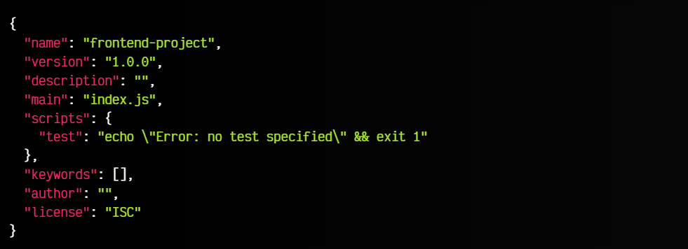

# Node.js y NPM
## Node.js
### ¿Qué es? 
En el pasado *JavaScript* (JS) era un lenguaje de programación únicamente por un motor de un navegador.
En el 2009, Ryan Dhal creó un entorno en el cual podía ejecutar *JavaScript* por fuera de un navegador. Lo hizo de la siguiente manera: al programa que escribió Ryan, le integro el *V8 de Chrome* (el motor de JS de ese navegador), el cual es código abierto y puede ejecutar con gran velocidad JS.
### ¿Cómo funciona?
NODE utiliza un **MODELO ASÍNCRONO Y ORIENTADO A EVENTOS**, lo que hace es que el procesamiento de una tarea no va a retrasar la ejecución de otras tareas, lo hace de manera liviana y eficiente. Está diseñado para construir aplicaciones en red escalables(la escalabilidad es la capacidad de una aplicación para manejar un número creciente de clientes o usuarios).

### ¿En qué áreas se usa?
1. Aplicaciones de una sola página (SPA): para construir una aplicación web con una experiencia similar a la de una aplicación de escritorio, Node.js es ideal. Ofrece un entorno eficiente para desarrollar SPAs.

2. Backend de redes sociales: LinkedIn, una red social líder, utiliza Node.js debido a su escalabilidad, el motor V8, una autenticación confiable y un enfoque basado en nodos.

3. Streaming de datos: Netflix, por ejemplo, para poder transmitir su contenido a millones de usuarios utiliza *Node.js*. Su naturaleza ligera, carga eficiente y velocidad lo hacen perfecto para aplicaciones de streaming de datos.

### Comando para ejecutar node.js
1. Posicionarse en la carpeta con el proyecto con extensión .js
2. Escribir en la consola ***node archivo.js***

## NPM
### ¿Qué es?
Node cuenta con su propio gestor de paquetes(es un sistema o conjunto de herramientas que se emplea para automatizar la instalación, actualización, configuración y utilización de programas) llamado **NPM** (Node Package Manager), considerado el sistema de librerías de código abierto más grande del mundo.

### ¿Por qué usar NPM?
1. Administrar las dependencias de tu proyecto, lo que incluye la instalación, actualización y eliminación de bibliotecas o programas de terceros.

2. Facilita el acceso a proyectos seguros de Node.js para el desarrollo de aplicaciones.

3. NPM te ayuda a desarrollar tus proyectos de manera más rápida y eficiente al proporcionar acceso a piezas de código ya creadas y probadas que otras personas han desarrollado y compartido.
4. Ofrece una amplia gama de herramientas disponibles de manera gratuita, lo que te permite elegir las que mejor se adapten a tus necesidades sin incurrir en costos adicionales.

5. Los comandos de NPM son fáciles de aprender y utilizar, lo que simplifica el proceso de desarrollo y no requiere una curva de aprendizaje prolongada.

### Comandos útiles
1. npm install -g [nombre del paquete] (instala el paquete de forma global)
2. npm uninstall -g [nombre del paquete] (desinstala el paquete de forma global)
3. npm update -g [nombre del paquete] (actualiza el paquete de forma global)

___
## El archivo package.json 

Cuando creas un nuevo proyecto utilizando el comando **npm init**, se inicia un proceso que te guía a través de algunas preguntas. Una vez que respondes estas preguntas, se genera un archivo llamado "package.json" en la carpeta principal de tu proyecto. También se puede crear el package sin pasar con el cuestionario haciendo **npm init -y**. Este archivo es como un documento que almacena información sobre tu proyecto en un formato que se parece a un texto estructurado. Dentro de este archivo, hay diferentes campos donde se guarda una variedad de información relacionada con el proyecto. 

En esta imagen se muestra un ejemplo de lo que muestra el archivo

## Encuesta de Stack Overflow en 2023
De acuerdo con la encuesta realizada por Stack Overflow en 2023
Node.js y React.js se destacan como las dos tecnologías web más empleadas entre todos los participantes, ya sean desarrolladores profesionales, personas que están aprendiendo a programar, entre otros.
Los desarrolladores profesionales muestran un uso prácticamente equitativo de Node.js y React.js, con un 42.65% y un 40.58%, respectivamente.
La mayoría de los usuarios de jQuery expresan su interés en aprender a utilizar Node.js o React durante el próximo año.

## Link a la presentación con videos
https://prezi.com/p/rc-i5ghulkce/?present=1

___
## Bibliografía

1. https://kinsta.com/es/base-de-conocimiento/que-es-npm/
2. https://www.youtube.com/watch?v=xJzzu7MVZXw
3. https://www.youtube.com/watch?v=BhvLIzVL8_o&t=3362s\
4. https://www.startechup.com/es/blog/node-js-what-it-is-used-for-and-when-where-to-use-it-for-your-enterprise-app-development/#Nodejs_for_Enterprise_App_Development
5. https://lenguajejs.com/npm/administracion/package-json/