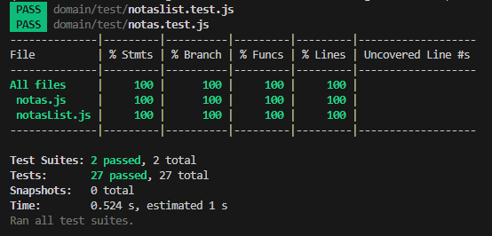

| Identificación   |
|:------------:|
| Fundamentos de Ingeniería en software      |
| M4D- Docentes: Alejandro Adorjan, Jhonny Kidd      |
| Agustin Alcarraz, María Victoria Chappuis, Serena Vera    |
| Noviembre 2023 |
| https://github.com/IngSoft-FIS-2023-2/obligatorio1-alcarraz-chappuis-vera.git |

# Proyecto: Desarrollo de app TDAH
Para poder correr las pruebas de Jest, como también las de ESLint, recomendamos pararse en la carpeta "domain" y utilizar el comando "npm i" o "npm install" para poder descargar todas las dependencias del obligatorio.

## Construcción
Principales funcionalidades de la aplicación:

Agregar Nota: Cuando el usuario accede a la sección de notas a través del menú en la parte inferior de la pantalla, puede agregar una nueva nota al presionar el botón con el icono de "más". Al hacerlo, se despliega un formulario que incluye campos para el título, el color deseado para la nota (con colores predefinidos por nosotros) y una sección de descripción. La entrada de datos es obligatoria en todos los campos para que la nota sea registrada correctamente.

Mostrar Nota: Al seleccionar el icono de "mostrar notas" en el footer, el sistema exhibirá todas las notas con los colores asignados por el usuario. La presentación de las notas se realiza en una disposición de grilla, y si el usuario registra más de tres notas, estas se mostrarán en filas subsiguientes.

Borrar Nota: En la sección de visualización de notas, cada una de ellas presenta un icono de "basura". Al hacer clic en este icono, la nota correspondiente se eliminará tanto del sistema como de la vista del usuario.

Mostrar Calendario: Al presionar el icono de "calendario" en el footer, se desplegará un calendario sin funcionalidad adicional.

## Documentación del uso de librerías externas
Hemos integrado las librerías de Bootstrap para mejorar la apariencia y funcionalidad de elementos clave en nuestra aplicación. Utilizamos Bootstrap para el botón de agregar nota, el menú de navegación y al diseñar la presentación de las notas. Es importante mencionar que inicialmente intentamos incorporar animaciones entre secciones utilizando jQuery en el HTML, pero debido a desafíos técnicos, no logramos implementarlo y nos olvidamos de eliminar el script correspondiente.

## Interfaz de usuario
En la carpeta GIF, se encuentra un gif mostrando cómo funciona el proyecto en términos generales.

Nuestra interfaz cumple con lo siguiente:

- Interfaz de usuario web / mobile responsive
- Tiene aplicado un sistema de diseño y principios de usabilidad.
- Estandard WACG2.0 (perceptible, operable, comprensible, robusto)

Nuestro proyecto se centra en el desarrollo de un calendario destinado a usuarios con Trastorno por Déficit de Atención e Hiperactividad (ADHD). A través de la investigación llevada a cabo para la primera fase del proyecto obligatorio, hemos llegado a la conclusión de que la interfaz de usuario debe ser diseñada con la máxima simplicidad posible.

Es crucial tener en cuenta que, aunque los colores desempeñan un papel importante para este grupo demográfico, debemos ejercer moderación en su aplicación. La saturación excesiva de colores podría generar distracciones fácilmente para las personas con ADHD. Por ende, nuestra estrategia se enfoca en utilizar colores de manera discernida y limitada, manteniendo un equilibrio que permita una experiencia visual amigable y enfocada.

Adicionalmente, reconocemos la importancia de la concisión en el contenido textual. Con el objetivo de optimizar la accesibilidad y la comprensión, nos esforzamos por presentar información de manera clara y directa, evitando la superabundancia de texto que pueda resultar abrumadora para nuestro público objetivo. La simplicidad y la claridad son pilares fundamentales en el diseño de la interfaz y la presentación de información en nuestro calendario para adolescentes con ADHD.

## Codificación

Nuestro proyecto obligatorio está organizado de manera estructurada en distintas secciones. Dentro de la carpeta "src" (fuente), encontramos la subcarpeta "domain" (dominio), que alberga las clases esenciales utilizadas en el proyecto, junto con sus respectivas pruebas que se encuentran en la carpeta "test".

Adicionalmente, en el directorio "domain", se ha creado la subcarpeta "interface". Esta sección alberga archivos HTML que representan la interfaz de usuario codificada, así como el archivo que contiene la lógica en JavaScript (js) subyacente y los estilos correspondientes (CSS). Este enfoque estructurado y modular facilita la comprensión y mantenimiento de nuestro código, permitiendo un desarrollo más eficiente y ordenado.

Por último, mediante la herramienta de ESLint, corregimos nuestro código para que cumpla con el Estandar de Codificación de Google.

## Test unitario
Tenemos dos Tests cruciales sobre nuestro proyecto: el Crear Nota y Agregar Nota
   

    CREAR NOTA
        test ("Nota valida Roja", () =>{
        let nota = new Notas("Este es mi titulo");
        nota.setTexto("Este es mi texto");
        nota.setColor("Rojo");
        expect(nota.getColor()).toBe('#FF0000'); 
        expect(nota.isValid()).toBe(true);
    });

    AGREGAR NOTA
       test ("Añadir una nota a la lista", () =>{
        let listaDeNotas = new NotasList();
        let nota = new Notas("Este es mi titulo");
        nota.setTexto("Este es mi texto");
        nota.setColor("Verde"); 
        listaDeNotas.add(nota);
        let expectedLength = 1;
        expect(listaDeNotas.getNotasList().length).toBe(expectedLength);
    });

Mediante Jest, realizamos las pruebas sobre las siguientes clases: Notas y NotasList. Las cuales muestran el 100 % de cobertura en cada una de ellas.

## Reflexión y separación de tareas
Agustín: 

Dada la dificultad para desarrollar el obligatorio desde cero debido a problemas en el JavaScript, decidí aprovechar lo que ya teníamos funcionando, es decir, el HTML y el CSS. Adapté nuestro código al ejemplo que vimos en clase y me enfoqué en implementar la funcionalidad de agregar y mostrar notas. Para lograr esto, me basé en el ejemplo proporcionado en clase y también busqué información en Internet para entender cómo recorrer la lista de notas y crear una nueva nota, utilizando eventos "click". Además, realicé una parte significativa de la corrección del ESLint y participé activamente en el proceso de pruebas.

El proyecto representó una experiencia gratificante para mí, especialmente al llegar a la etapa del "code freeze" y comprobar que logramos completar todos los aspectos evaluados con éxito. Además, la oportunidad de desarrollar una aplicación que podría ser de utilidad para personas de mi edad añadió un componente único y significativo a la experiencia.

Victoria:

Me gustó mucho este proyecto ya que fue el primero de la carrera que elegimos nosotros. Trabajamos muy bien como equipo y aunque nos presentamos con varias frustraciones, el outcome del proyecto nos gustó mucho. Por mi parte, mi principal función fue la de la pestaña del calendario, la procuración de tener un clean code, el manejo de pestañas y encontrar librerías prolijas y consistentes. El JS pudimos mejorarlo una vez visto el ejemplo que dieron en clase, ya que antes habíamos hecho uno que no cumplía con la altura técnica necesaria.

Serena:

 En resumen, siento que este proyecto ha sido muy enriquecedor en muchas áreas, tanto como el trabajo en equipo, como el aprendizaje de nuevas tecnologías y la reutilización de otras ya conocidas. El trabajo dentro del equipo fue bastante uniforme y con buen uso de la comunicación, y superamos varios desafíos de todo tipo en cuanto a los desafíos de programación, tanto la búsqueda e implementación de las tecnologías nuevas, intentar reciclar códigos, entre otros. Los principales desafíos a los que me enfrenté son la parte del HTML como el CSS, la navegación entre botones y el footer y las funciones de main.js.

## Reflexión grupal:

Este proyecto fue una experiencia única que nos permitió aplicar de manera práctica los conocimientos adquiridos, especialmente en el uso de GitHub, así como poner en práctica los conceptos previos aprendidos en programación I.

La aplicación de técnicas de elicitación fue crucial, ya que reveló la necesidad de obtener información diversa para el desarrollo del planner. Aunque este proceso demandó tiempo, contribuyó significativamente a fortalecer nuestro entendimiento y mejorar la calidad del proyecto.

Esta instancia fue particularmente enriquecedora para nosotros, ya que pudimos trabajar en un proyecto que captó nuestro interés. La motivación resultante fue un factor clave que nos impulsó a hacer realidad nuestras ideas y llevar a cabo el proyecto con éxito.

## Test Del Sistema del otro grupo, Informe de Calidad del Sistema y Reporte de Issues
En el archivo informe_testing.md se encontrará todo lo relacionado a lo que se menciona en el título.