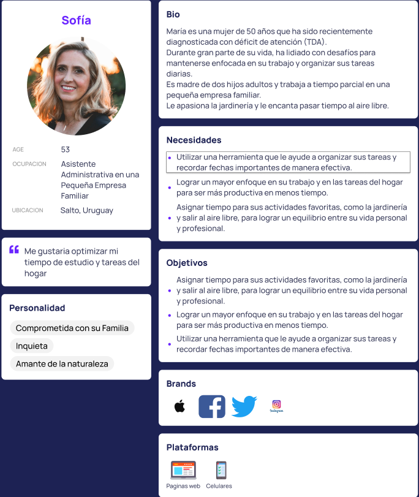
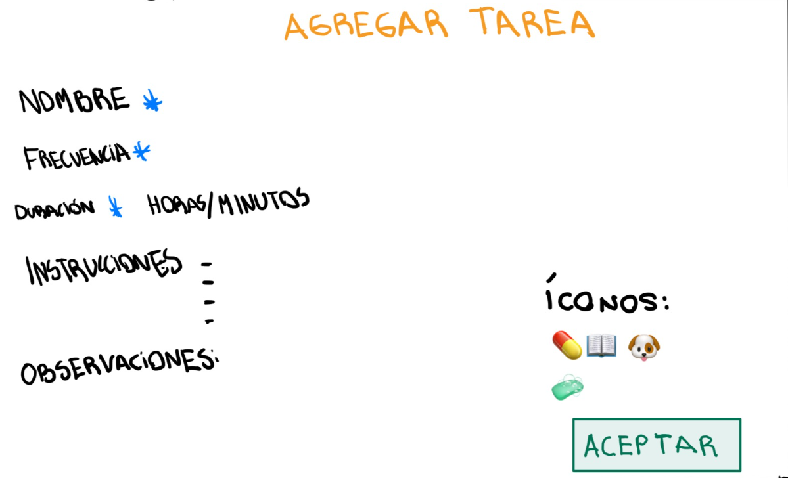
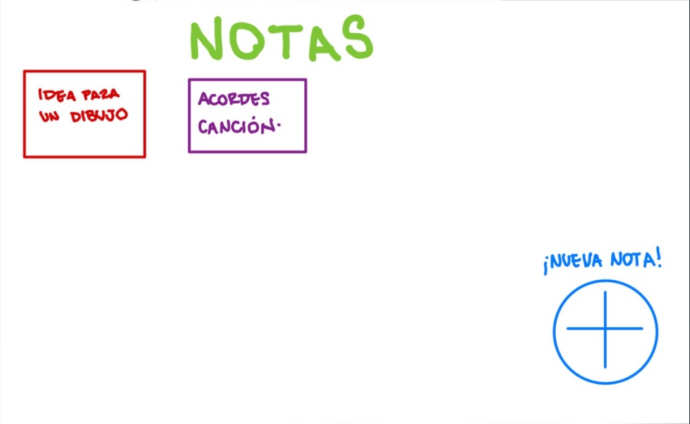
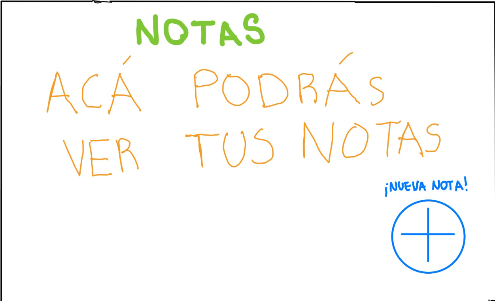
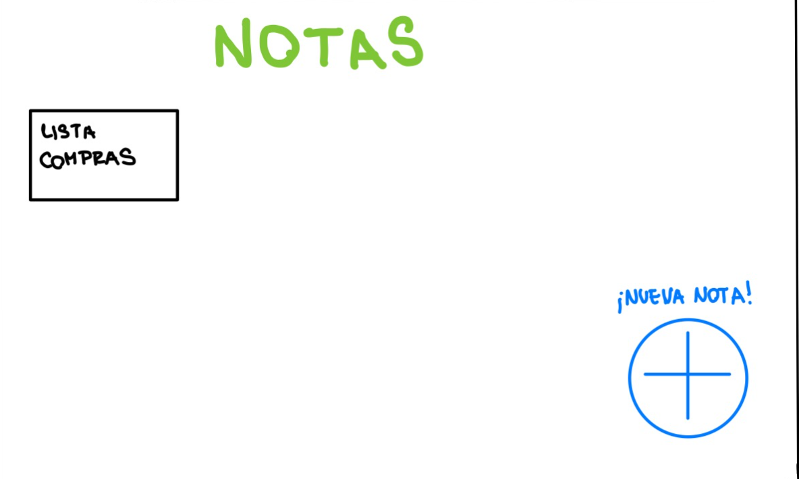
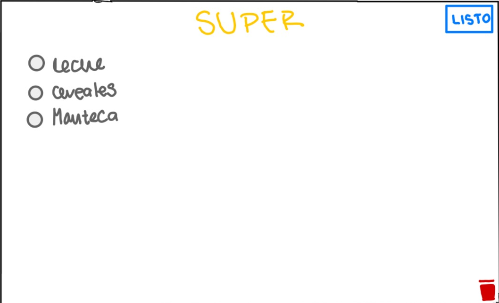
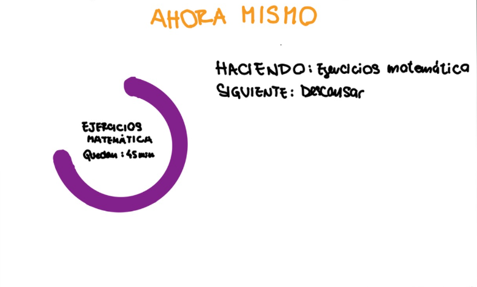
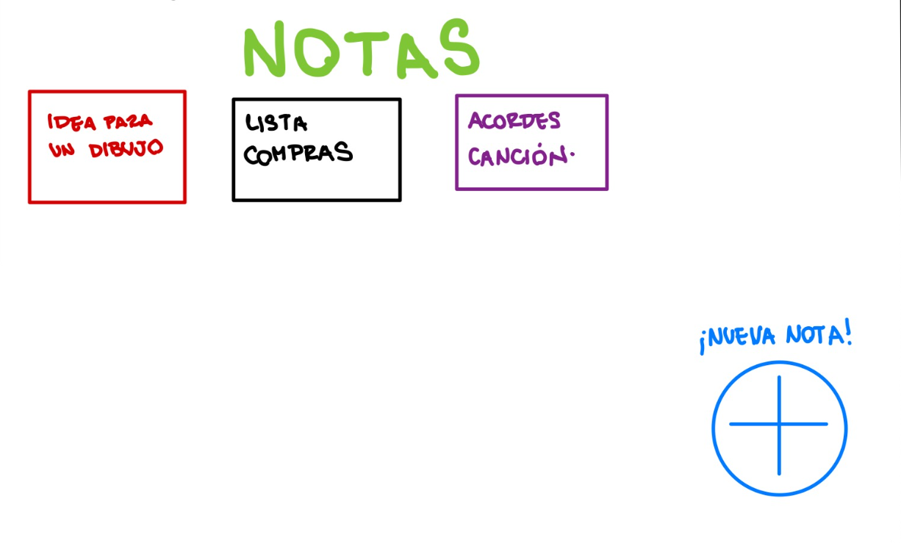
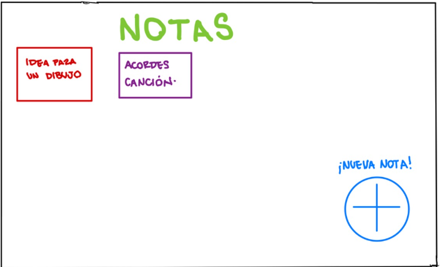

M4A - Docentes: Alejandro  Adorjan
- Agustin Alcarraz 281644
- Victoria Chappuis 278311
- Serena Vera 267108

# Fundamentos de Ingeniería en Software
## Objetivos: 
El objetivo de nuestro proyecto es hacer un planner visual para ayudar a adolescentes con TDAH (Trastorno por Déficit de Atención e Hiperactividad). Este debe ser altamente customizable, adaptarse a las necesidades, problemas , limitaciones y desafíos que presentan el día a día de un adolescente con TDAH.
Para cumplir con estos objetivos, intentamos que nuestra app se adapte lo mejor posible ciertos criterios organizacionales, visuales y de organización que favorecen su entendimiento, concentración y atención. Como consecuencia de esto, mejora su productividad diaria, ayudando a que no se desenfoquen y no pierdan sus objetivos de vista,  su rendimiento diario y poco a poco, ayudarlos acercarse a su potencial máximo.

## Stakeholders
1. Adolescentes con TDAH: los usuarios finales del programa, ellos son quienes hacen la decisión final de usar la app o no.
2. Profesionales y expertos del tema: por ejemplo, psiquiatras, profesores, técnicos de dificultades de aprendizaje, entre otros. Ellos tienen entendimiento profundo en la condición y al probar nuestra app reconocerán fácilmente que realmente ayuda a un adolescente con TDAH y que no.
3. Redes sociales, influencers, etc. Promueven y popularizan la app. 

## Repositorio Git: Uso de ramas separadas

Creamos un repositorio en GitHub, en el cual vamos a subir todo nuestro trabajo a este repositorio remoto, utilizando los comandos dados en clase. En él está el Readme.md en el cual está todo el trabajo del obligatorio. A su vez, están presentes las carpetas "casosDeUso" en donde tiene las imágenes correspondientes a los perfiles que consideramos adecuados para nuestra aplicación.

## Versionado:
Primero uno de los integrantes creó un repositorio remoto, para luego compartirlo con los otros integrantes. Para ello, cada miembro del equipo realizó **git clone "url"** para poder trabajar de manera local.

El obligatorio cuenta con dos ramas, una llamada **dev**, que se refiere a desarrollo, donde vamos subiendo todos nuestros avances del proyecto. Por otro lado, tenemos la rama **main** donde va la versión final del proyecto o para subir alguna versión que haya llegado a ciertos logros o avances que nos parezcan significantes. Para hacer un merge al main, con el objetivo de que esta en su última versión sea igual a la última version del dev, hacemos un **git checkout main** en el caso de que estemos parados en el dev, y luego ejecutamos el comando **git merge dev** para que se haga un merge de ambas.

Antes de comenzar a trabajar hacemos **git pull** para tener el ultimo commit del repositorio hecho por nuestros compañeros.
Luego, para desarrollar nos paramos en la rama dev haciendo **git checkout dev**, ahí mismo hacemos los cambios que consideremos necesarios, cuando terminamos de trabajar o cuando pensamos que terminamos de hacer cierto avance y queremos "pasar raya" y seguir con una tarea de desarrollo no relacionada a la anterior, le damos "save" o **"CTRL + S"**  y luego en consola hacemos **git add .** y **git commit -m "descripcion del avance"** o directamente **git commit -a -m "descripción del avance"** podemos hacer distintos commits dentro de nuestro repositorio local. Por ejemplo en el caso de que sean cambios de distintas tareas del proyecto, y cuando hayamos terminado de trabajar, hacemos un **git push** y esto hace que todos nuestros avances o commits se suban al repositorio remoto, quedabdi grabados en la nube y nuestros compañeros o cualquiera que acceda este pueda acceder a nuestra última versión del proyecto.

# ELICITACIÓN
Con el objetivo de profundizar en el tema del TDAH y los planners diarios llevamos a cabo: una entrevista, una investigación y ingeniería inversa de dos apps de planning diario.
- Entrevista: realizada con Laura Fazacas, técnica de estudio especializada en dificultades de aprendizaje. La evidencia de nuestras actividades de investigacion se encuentra dentro de la carpeta src.

- Ingenieria Inversa: investigamos y evaluamos dos apps para daily planning: Tiimo y Notion. Nos enfocamos en desglosar sus características clave, prestando especial atención en la interfaz de usuario y diseño. Buscamos patrones de diseño efectivos y mejores prácticas que podamos incorporar en nuestra propia aplicación.¿Por qué elegimos estas dos y no otras? Notion es la más usada por estudiantes y Tiimo tiene como objetivo ser un planner más que nada visual hecho para personas con TDAH.
- Investigación: 
Fue extraída de tres fuentes principales:
1. El libro: "Convivir con Niños y adolescentes con Trastorno por Déficit de Atención e Hiperactividad"
2. Guía Práctica para los Trastornos de Déficit Atencional con/sin Hiperactividad - Alberto Espina y Asunción Ortego
3. Cómo actúan los colores sobre las emociones y sentimientos en los niños con TDAH - Universidad de Vallanoid
La primera fuente fue usada principalmete para proveernos un marco teorico de que es el TDAH, como afecta a los adolescentes y que dificultades presentan. Por otra parte, la segunda fuente fue utilizada para extraer de una guia para Psicopedagogos y Profesores sobre como mediar con ni;os y adolescentes con TDAH ciertas modalidades que nos parecieron clave y pueden ser aplicadas a la app, mientras que la tercera fuente fue utilizada para extraer que colores ulitlizar en nuestra interfaz.

## Entrevista
Llevamos a cabo una entrevista con Laura Fazacas, ella es una técnica de estudio especializada en dificultades de aprendizaje. 
Su trabajo diario consiste en ayudar con tareas diarias a estudiantes de todas las edades con dificultades de aprendizaje, diagnosticadas o no, como pueden ser Dislexia, Disgrafía, Discalculia, Discapacidad de la memoria y el procesamiento auditivo, Trastorno por déficit de atención e hiperactividad (TDAH), Trastorno del espectro autista/Trastorno generalizado del desarrollo, entre otros.

En aspectos generales, comenzamos hablando de nuestros objetivos y a quienes estaba dirigido el proyecto, que es el TDAH, que tipos de TDAH existen, cómo podemos ayudarlos en su día a día, que problemas suelen tener las personas que trata y qué estrategias usa ella para ayudarlos.
Luego pasamos a hablar sobre como ella desarrollaría el planner ideal para un adolescente con TDAH, que factores son clave, que cosas debemos cuidar y que deberíamos evitar.

### Conclusiones de la entrevista
- El TDAH tiene varios tipos, y las personas con TDAH suelen padecer de otros trastornos mencionados anteriormente.
- Es imposible cubrir todas las necesidades o hacer un planner ideal para todos porque no todos tienen las mismas dificultades.
- Las técnicas organizacionales que se enseñan a las personas con TDAH le pueden servir a cualquiera.

Nos brindó consejos para tratar y generar recursos para personas con TDAH, estos son:
- Otorgar tiempo adicional tanto en su trabajo diario como en las evaluaciones. El tiempo que demanda procesar información es mayor.
- **Estimular y apoyar la organización** de todas sus tareas. Se ven beneficiados por la **anticipación**. Saber que viene siguiente, cuales son los eventos del día, etc.
- Presentar **instrucciones pautadas** para las tareas, el espacio gráfico suficiente para desarrollarla, escribir lo que sea necesario y a continuación la siguiente propuesta.
- Permitirle **descanso entre tareas** y cierto tiempo para que se "mueva" y retome la tarea.
- Es difícil para ellos anticipar cuánto tiempo les lleva prepararse y conmutar para atender ciertos eventos. Debemos recordarles antes de este tiempo, y darles instrucciones **claras y concisas** de cómo prepararse, como llegar, qué ómnibus, etc.
- Evitar cualquier elemento que pueda generar confusiones/desentendimientos: Simplificar enunciados, utilizar lenguaje claro y directo, reducir cantidad de preguntas, evitar letras con serifas, Escribir ciertos elementos clave en mayúsculas es de gran ayuda y utilizar colores fácilmente distinguibles.
- Tener siempre en cuenta que los "elementos distractores" pueden ser perjudiciales para su desempeño.
- Deben poder visualizar su semana y a la vez tener sus tareas del día y sus horarios todos en un mismo lugar.
- La visualización es una estrategia clave, los gráficos los ayudan a **visualizar** la información y procesarla más eficientemente.
- Las tareas diarias y el visualizador semanal deben ser lo primero que vean, de lo contrario genera distorsiones.
- Las tareas completadas deben ser desechadas o tachadas para generar un estímulo positivo además de una mejor representación visual de las tareas próximas.
- Puede servirles iconizar ciertas tareas si lo desean.
- Es importante que sus acciones tengan un **feedback positivo** y no hacerlos sentir mal en caso de que no hayan llegado a cumplir con ciertos estándares. Algún tipo de premio siempre es bueno.
- La Técnica Pomodoro es un método para concentrarse probado muy eficiente para ellos.
- La app debe tener la posibilidad de imprimir el planner de la semana, a muchos de sus estudiantes les gusta tener su planner en la heladera, escritorio, cuarto, tenerlo en muchos lugares y muchas copias genera más instancias de recordatorios.
- Muchos toman pastillas para la concentración: recordatorio de tomar las pastillas y marcar las horas de concentración.
- Es difícil aprenderse información clave como número de cédula de identidad, número de teléfono de contactos importantes, dirección de casa, etc.
- Necesitan un lugar para poder tomar notas, hacer checklists, etc.

## INGENIERIA INVERSA
### Tiimo
Features principales:
- Al empezar te pregunta si eres un pensador visual neurodivergente, esto permite que la app se organice de distintas maneras y da recomendaciones según las necesidades del perfil definido. También pregunta para qué quieres usar la app, ofrece opciones como: tareas del hogar, estudio, trabajo, etc.
- Elegir objetivos para que nos ayude, estos pueden ser: estrés, ansiedad, querer estructurar nuestras rutinas mejor, mejorar la concentración, entre otras.
- Nos permite crear un reminder para revisar los planes del día cada mañana y editarlos, también nos ofrece una revisión para la noche con el objetivo de revisar las tareas pendientes.
- Recordatorios diarios de ciertas tareas están disponibles
- Cuando se agrega una tarea, se le asigna un color y una representación visual. Además, se pueden establecer horarios y duraciones específicas para cada tarea, incluyendo un horario de inicio y finalización. Se brindan opciones flexibles, permitiendo establecer la duración de la tarea en cualquier momento del día o para toda la jornada. También se pueden programar repeticiones diarias, de lunes a viernes o mensuales, según sea necesario.
- En la página principal se presenta una visualización de nuestra semana con las actividades planificadas para cada día y un área con un *checklist* de las actividades de hoy.
- Posee una sección de notas para agregar información adicional.
- En una de las pestañas se muestra la tarea que debería estar sucediendo en tiempo real, indicando la hora actual, de qué hora a qué hora es y cuánto tiempo restante para terminar la tarea, excelente para visualizar nuestro tiempo. Esto brinda una experiencia visual completa para el usuario y permite visualizar y esquematizar nuestro tiempo

### Notion
Notion es una aplicación de gestión que se adapta a una amplia variedad de necesidades. Su funcionamiento se basa en la creación de “carpetas” o “bases” que pueden contener una variedad de elementos como texto, listas de tareas, tablas, bases de datos, archivos adjuntos, y más. Estas bases tienen una estructura jerárquica, que permite organizar las páginas de manera estructurada, a modo de tener páginas principales y subpáginas dentro de ellas.
 
### Funcionamiento de Notion:
 
1. Creación de páginas: los usuarios pueden crear páginas en blanco o elegir entre plantillas predefinidas para diferentes tipos de contenido, como notas, tareas, calendarios, entre otros.
 
2. Personalización: cada página es altamente personalizable. Los usuarios pueden agregar texto, listas de tareas, imágenes, enlaces, y más, para adaptarla a sus necesidades específicas.
 
3. Organización: las páginas se organizan en bases o carpetas, lo que facilita la estructuración de la información. Además, se pueden utilizar etiquetas y filtros para categorizar y buscar contenido rápidamente.
 
4. Colaboración: Notion permite la colaboración en tiempo real, lo que facilita el trabajo en equipo. Los usuarios pueden comentar en las páginas, asignar tareas y compartir documentos con otros usuarios.
 
### Dificultades para personas con déficit de atención:
 
1. Complejidad visual: Notion ofrece muchas opciones de formato y personalización, lo que puede resultar abrumador para personas con déficit de atención. Puede ser útil proporcionar una configuración simplificada o plantillas específicas para evitar distracciones visuales innecesarias.
 
2. Organización: Aunque la organización es una de las fortalezas de Notion, algunas personas con déficit de atención pueden encontrar desafíos para mantener una estructura coherente. Se recomienda proporcionar orientación y plantillas predefinidas para ayudar en este aspecto.
 
3. Fácil distracción: Notion es una herramienta flexible con muchas funciones, lo que podría llevar a distracciones si no se usa con un propósito específico. Se debe fomentar el enfoque en tareas concretas y proporcionar recordatorios visuales para mantenerse en el camino.
 
4. Gestión del tiempo: Las funciones de gestión del tiempo, como los calendarios y las fechas de vencimiento de tareas, son útiles, pero las personas con déficit de atención pueden necesitar recordatorios adicionales y alertas para seguir un horario.

 
## Conclusiones de la ingeniería inversa:
 Tiimo se destaca por su enfoque visual y la adaptabilidad a las necesidades de personas neurodivergentes, especialmente aquellas con TDAH. Ofrece una personalización significativa al permitir la elección de objetivos y la asignación de colores y representaciones visuales a las tareas. La visualización en tiempo real de las tareas proporciona una experiencia completa y facilita la gestión del tiempo de manera efectiva.

Mientras que Notion es una poderosa herramienta de organización e información, pero para las personas con déficit de atención, puede requerir una adaptación cuidadosa para evitar distracciones y garantizar una experiencia más enfocada y productiva. Esto se puede lograr mediante la simplificación de la interfaz, la orientación clara y la implementación de recordatorios visuales.

 
## INVESTIGACIÓN

### ¿Qué es el Trastorno por Déficit de Atención e Hiperactividad o TDAH?
El TDAH es un trastorno psiquiátrico de origen biológico, a nivel cerebral, y con transmisión genética, que afecta a la capacidad del niño, adolescente o adulto de:
- regular su nivel de actividad, por lo que tienen hiperactividad,
- inhibir o frenar sus ideas, pensamientos o comportamiento, por lo que tienen impulsividad.
- prestar atención a las acciones que realizan, por lo que sufren inatención.

### ¿Que tipos de TDAH existen?
- TDAH tipo hiperactivo-impulsivo (el niño sólo presenta hiperactividad e impulsividad), que es muy poco frecuente.
- TDAH tipo inatento (presentan inatención).
- TDAH tipo combinado (el mito presenta los tres síntomas hiperactividad, impulsividad e inatención), que es el más frecuente.

### ¿Puede una persona con TDAH no ser hiperactiv@?
Claro que sí. No todas las personas con TDAH son hiperactivas. Las personas con TDAH tipo inatento no tienen hiperactividad o impulsividad; sólo presentan síntomas de inatención: cometen errores por no prestar atención a los detalles, no mantienen la atención en tareas largas, parece que no escuchan, tienen dificultad para completar órdenes complejas (dejan las cosas a medias), evitan las acciones que requieren esfuerzo mental (dejan los deberes siempre para el final), son muy desorganizados, pierden cosas, son olvidadizos y se distraen con facilidad.

### ¿Qué características tiene y cómo se reconoce la inatención?
Las personas que presentan inatención tienen muchas dificultades para realizar una misma actividad durante mucho tiempo. Se aburren enseguida tras unos minutos haciendo la tarea, su mente comienza a fluir 
 y empiezan a pensar en otras cosas. Tienen que hacer un esfuerzo extra para terminar acciones rutinarias y mantenerse organizados. De lo contrario se distraen con cualquier estímulo que se cruza en su camino. por ejemplo, al prepararse para empezar el día de madrugada, si mientras se visten ven algo que les llame la atención, por ejemplo el celular, se quedan medio vestidos jugado o checkeando las redes sociales. Hay que recordarles muchas veces que deben irse al liceo o universidad y convencerlos que vuelvan a enfocarse.

### ¿Qué características tiene y cómo se reconoce la hiperactividad?
Las personas con hiperactividad están en movimiento constante, y tienen muchas dificultades para permanecer sentados durante mucho tiempo (en clase, en la cena, en el templo, viendo la TV, etc.).
Se levantan y merodean sin sentido, y hablan sin parar. Les resulta imposible aguantar una clase entera sentados y quietos.
Se levantan y dan vueltas por la clase si se les permite. Cuando están sentados, se mueven mucho en la silla, enredando con los pies y manos, cambiando de postura, tocándolo todo, por lo que, con frecuencia, las cosas se les caen al suelo. Son ruidosos, y están siempre dando golpecitos en la mesa o canturreando.
Otras veces, aunque no se mueven, dicen que se sienten inquietos o nerviosos. Los padres cuentan que estos niños mordisquean y rompen los lápices y bolígrafos, desarman las cosas con piezas, perdiendo o estropeando algunas y no pueden armarlas de nuevo (desarman un bolígrafo y pierden el muelle o lo estiran); a veces, también muerden la ropa o arrancan los hilitos que sobresalen hasta que los rompen.

### ¿Qué características tiene y cómo se reconoce la impulsividad?
Los niños y adolescentes con impulsividad tienen dificultades para inhibir o modular sus respuestas o reacciones inmediatas ante las situaciones. Es decir, les resulta difícil no hacer lo primero que les apetece o se les ocurre. No piensan en las consecuencias de sus actos y directamente hacen (o dicen) lo primero que piensan, lo que se les pasa por la cabeza. Por eso, en clase responden sin pensar, a veces, incluso antes de que el profesor haya terminado de formular la pregunta, sin pensar realmente en lo que se les está preguntando. Hacen comentarios inapropiados sin pensar en la reacción de la otra persona. Por ejemplo, dicen en voz alta "vaya tontería" tras una explicación del profesor, lo que les acarrea un castigo o un punto negativo. Un niño sin impulsividad pensaría que lo que dice el profesor es una tontería, pero que si él lo dice en alto le pueden castigar y decidiría no decir nada. Algunas personas con TDAH no tienen ese diálogo interior antes de realizar una acción, no valoran las posibilidades ni las consecuencias de cada posible respuesta, simplemente actúan y luego las sufren. Sólo ven las consecuencias de sus actos cuando es demasiado tarde y ya han hecho o dicho algo inapropiado. Sin embargo, no aprenden, y más adelante se vuelven a dejar llevar por la primera cosa que se les ocurre, reaccionando impulsivamente.

### ¿Cómo son los adolescentes con TDAH?
Los adolescentes con TDAH pueden no tener una hiperactividad tan evidente, ya que con la edad esto puede tratarse o mejorarse, pero todavía enredan en exceso con las manos, hacen ruiditos, dan golpecitos y sienten inquietud interna. Sin embargo, todavía son desorganizados en sus trabajos escolares y les cuesta mucho acabar las cosas. Les resulta difícil trabajar de forma independiente, todavía hay que estar encima de ellos para que acaben sus tareas y estudios. Suelen tener más comportamientos arriesgados relacionados con la impulsividad (fumar, beber, consumir drogas, tener accidentes, actuar impulsivamente, etc). Sufren autoestima baja por sus fracasos, y por sus peores relaciones con sus iguales presentan dificultades y encontronazos con las figuras de autoridad (padres, profesores, entrenadores). A veces, si el niño es inteligente y sus padres han estado muy pendientes de las tareas escolares, puede no notarse el TDAH hasta la adolescencia, donde los trabajos son más complejos y se requiere no sólo un trabajo mecánico, sino asociación de conceptos aprendidos anteriormente.

### ¿Qué complicaciones tienen los adolescentes con TDAH?
Según ciertas estadísticas, tienen más riesgo de empezar a fumar tabaco, beber alcohol, consumir drogas como marihuana y tener relaciones sexuales más tempranas (y por ello tienen hijos mucho antes y más enfermedades de transmisión sexual) que los adolescentes sin TDAH. También repiten curso más frecuentemente y terminan el bachillerato y pasan a la Universidad en menor proporción que los adolescentes que no poseen estas condiciones. Esto se debe a que no piensan las consecuencias de sus actos y no aprenden de sus errores.

### ¿Qué neurotransmisores están implicados en el TDAH?
Los estudios indican que en el TDAH hay problemas en los circuitos reguladores 
que comunican el córtex prefrontal y los ganglios basales. Estas dos áreas del cerebro se comunican mediante la dopamina y la noradrenalina. Estas zonas y circuitos están, además, regulados por inervación dopaminérgica procedente de la zona de los pedúnculos cerebrales en el tronco del encéfalo. Los estudios con animales indican que niveles bajos de noradrenalina en el cerebromproducen hiperactividad e impulsividad. El córtex prefrontal controla la persistencia en una tarea (atención mantenida), la resistencia a la distracción (inhibición motora), y la capacidad de volver a una tarea después de distraernos (memoria de trabajo).

### 11. ¿Qué medidas y estrategias suelen tomar los profesionales al tratar con TDAH?
Como hemos señalado anteriormente el TDAH suele ir asociado a Trastornos del Aprendizaje y el fracaso escolar es frecuente, sobre todo en los casos en los que el déficit de atención es severo, el CI(Coeficiente Intelectual) del alumno es medio bajo o no recibe la estimulación y el control adecuados por parte de la familia y escuela.
En muchos casos, son alumnos con necesidades educativas especiales ya que el ritmo de adquisición de los contenidos académicos varía mucho del de sus compañeros.

Los objetivos a trabajar en los espacios de apoyo no son solamente académicos, el refuerzo en algunas asignaturas o en la adquisición de conocimientos y habilidades
está mediatizado por los procesos de atención. Enseñar "cómo hacer lo que se sabe", ya que no carece de la capacidad para aprender sino que tiene dificultad para organizar lo que ya sabe y reproducirlo del modo y en el momento adecuado. Son también objetivos a trabajar las relaciones sociales y la disminución de la hiperactividad e impulsividad.

La organización del material de estudio y la tarea deben sistematizarse, hay que insistir en que repase los materiales para la actividad diaria, favorecer que llegue a mecanizar estas actividades, estructurar el trabajo, ayudarle a planificarlo. Preparar material que sea "atractivo" y estimulante para que el trabajo en la escuela y el hogar faciliten su motivación. En tiempos de clase o estudio, es conveniente permitir al niño que cada cierto tiempo se mueva de la silla.

Las estrategias que mejor resultado han dado son:
- **Estructurar la actividad** . El objetivo es ayudar a que el alumno desempeñe adecuadamente las actividades que tienen que ver con la memoria de trabajo y sistematice actividades. Es conveniente hablarle sobre lo que se va a trabajar y qué se va a lograr con ello, cuánto tiempo va a durar y si habrá o no descanso, qué material va a utilizarse y retirar el que no sea necesario. Hay que explicar las normas y proveer las instrucciones claras, breves, y si fuera posible utilizar material llamativo como carteles de colores que el adolescente pueda ver y le recuerden la tarea a realizar.
-  **Expresar de modo claro las consecuencias positivas de la realización de la actividad**. Para ello hay que motivar al niño sistemáticamente, ya que los procesos de atención sostenida suponen un gran reto para él. Los premios no deben ser necesariamente materiales sino de fortalecimiento de la autovaloración y autoconfianza y deben ser inmediatos a la consecución de la tarea.
- **Los comentarios de ánimo u otras formas de refuerzo** (sonrisas, fichas canjeables por privilegios, etc.) han demostrado su efecto positivo en las personas con TDAH, y el uso de la retirada de esta atención positiva ante  conductas inadecuadas puede hacerlas disminuir. Esta ignorancia activa hacia el niño exige la retirada total de la atención.
- Anticiparse a las "situaciones problema", aquellas en las que aparecen dificultades para el alumno, tanto de atención como de impulsividad-hiperactividad, (cambios de clase, salida al recreo) en definitiva, cambios en la actividad.

### ¿Por qué es importante el uso de los colores trabajando con TDAH?
1. **Facilita la organización**: El TDAH a menudo se asocia con dificultades en la organización y la planificación. El uso de colores puede ayudar a crear sistemas visuales que faciliten la organización, como etiquetar carpetas o tareas con colores específicos para categorizarlas.

2. **Mejora la atención**. Los colores pueden ayudar a captar la atención de las personas con TDAH. Utilizar colores brillantes o destacados en material de estudio o presentaciones puede hacer que la información sea más atractiva y memorable.

3. **Fomenta la estructura**. La estructura y la rutina son importantes para las personas con TDAH. Usar colores para marcar diferentes momentos en el día o actividades específicas puede ayudar a crear una estructura visual que les permita mantenerse enfocados y seguir un horario.

4. **Diferencia la información**. El uso de colores puede ser útil para resaltar información importante o relevante en un texto o gráfico. Esto puede ayudar a las personas con TDAH a identificar rápidamente lo que es esencial y a concentrarse en ello.

5. **Reduce la sobrecarga sensorial**. Las personas con TDAH a veces pueden ser sensibles a la sobrecarga sensorial. Utilizar colores suaves o colores que ayuden a crear un ambiente tranquilo y relajante puede ser beneficioso para reducir el estrés y la ansiedad.

### ¿Qué efectos nos producen los colores?
- El **rojo** es un color que significa vitalidad y energía. Con él se intenta estimular la acción. Es un color poco recomendable para la concentración porque impide la concentración.
- El **amarillo** estimula la actividad mental asi que suele ayudar en la concentración. Por ello se usa en los libros y algunas veces en los sitios de trabajo de los niños.
- El **naranja**, un color que mezcla el amarillo y el rojo, aporta la energía y por otro lado la alegría.
- El **verde**: relaja el sistema nervioso, produce armonía. Es ideal para ambientes de descanso.
- El **azul** va unido a la relajación de los niños produce paz y sueño.
- El **violeta** se utiliza para la inspiración y para la intuición. Estimula la creatividad y la habilidad artística.

## Modelado de usuarios del Sistema
Esta aplicación esta deseada enfocada a personas con TDAH sin embargo muchas personas elijen usar este tipo de métodos, por lo tanto también vamos a agregarlos a nuestro publico

## ESPECIFICACIÓN
## Requerimientos Funcionales

###  RF1: Visualización de tarea
**Actor**: Usuario

**Descripción**: Cuando el usuario abre la app, lo primero que debe ver es su semana y tareas del día.

**Prioridad**: Alta

###  RF2: Ingreso y actualización de tareas 
**Actor**: Sistema

**Descripción**: El usuario debe poder tanto ingresar y actualizar el estado de las tareas en su planner y cuando una tarea se completa debe desaparecer para poder visualizarse mejor el calendario.

**Prioridad**: alta

### RF3: Feedback positivo:
**Actor**: Usuario

**Descripción**: El sistema deberá mostrar un cartel de "Tarea completada" y mostrar una explosión de confeti en el momento que el usuario finalice una tarea.

**Prioridad**: Alta

### RF4: Notas
**Actor**: Usuario

**Descripción**: El usuario podrá tener la opción de poder escribir notas rápidas

**Prioridad**: Media

### RF5: Agregación de alarmas
**Actor**: Usuario

**Descripción**: El usuario deberá poder agregar recordatorios, de modo que se le active una alarma.

**Prioridad**: Media

### RF6: Anticipación de las tareas de día
**Actor**: Sistema

**Descripción**: Al comenzar el día, el sistema deberá mostrar todas las tareas y eventos que sucederán en el día.

**Prioridad**: Alta.

## Requerimientos no Funcionales

### RNF1: Sistema de compatibilidad
**Descripción**: el planner deberá soportar celulares con sistema operativo: Android 10 o IOS 13 o sus versiones superiores.

### RNF2: Idiomas soportados
**Descripción**: la aplicación deberá ser desarrollada principalmente en español e inglés.

### RNF3: Validación de la aplicación
**Descripción**: para poder subir la aplicación tanto para la Play Store de Android como en la App Store de IOS, deberá cumplir con los estándares de dichas tiendas .

### RNF4: Impresión
**Descripción**: el usuario podrá tener la opción de imprimir su calendario. 

### RNF5: Formato de la aplicación
**Descripción**: se deberá mostrar en formato horizontal, con el texto de fuente Tahoma y en mayúsculas.

### RNF6: Tiempo de máximo de tareas
**Descripción**: si una tarea dura más de 45 minutos debe tener un descanso mínimo de 5 y una tarea no puede durar más de 2 horas.

## HISTORIAS DE USUARIO

## Modelo conceptual del problema
[diagrama de cada página]

## Historias de usuario 1
**Título:** Planificación

- **Como** usuario
- **Quiero** poder planificar mi vida diaria y semanal
- **Para** estimularme y poder tener una organización sobre mi vida

**Criterios de aceptación:**
El usuario podrá ver en el calendario sus tareas en sus respectivos días.

## Historias de usuario 2
**Título:** Feedback positivo

- **Como** usuario
- **Quiero** que cada vez que complete una tarea se me recompense
- **Para** sentirme motivado y seguir usando la aplicación.

**Criterios de aceptación:**
- Al terminar cada una de las tareas, el sistema brindara un cartel grande que dice "Tarea Completada", junto a una explosión de confeti.

## Historias de usuario 3
**Título:** Representación temporal de las tareas

- **Como** usuario
- **Quiero** poder ver cuánto tiempo me queda para terminar mi tarea
- **Para** poder concentrarme y ser consciente sobre como debo lidiar con esta.

**Criterios de aceptación:**
- El usuario tendrá que ingresar una tarea para poder ver cuánto tiempo le falta para terminarla en la sección de **Ahora Mismo**.

## CASOS DE USO
## Caso de uso 1: ARREGLAR

*PRE: la tarea no esta registrada en el sistema*

*POS: El sistema registra la tarea*

**Título:** Ingreso de tareas

**Actor:** Usuario

**Curso Normal:**

| Acción de los actores | Respuesta del Sistema |
|--------------|--------------|
| 1. El usuario completa el formulario de la tarea   | 2. Se agrega al calendario  |

| 1|2 |
|--------------|--------------|
|  | |

### Curso alternativo:
1.1 El usuario no completa los campos obligatorios.

1.2 El usuario completa los campos obligatorios y confirma los datos.

1.3 El sistema agrega la tarea al calendario.

## Caso de uso 2:
*PRE: el usuario tiene que tener una tarea ingresada en el sistena*

*POS: El sistema muestra en tiempo real cuanto tiempo restante le falta a la tarea actual, como tambien cual es la siguiente*

**Titulo:** Realizar una tarea

**Actor:** Usuario

**Curso Normal:**

| Acción de los actores | Respuesta del Sistema |
|--------------|--------------|
| 1. El usuario selecciona la sección de **AHORA MISMO** | 2. El sistema un reloj, representando el tiempo restante de la tarea actual y por separado la siguiente tarea por realizar|

### Curso alternativo:
1.1 El usuario al no tener tareas disponibles en ese momento, selecciona esa sección del planner.

1.2 En la pantalla le saldrá un cartel el cual aparecerá "No hay tareas por completar".

## Caso de uso 3:

*PRE: es la primera vez que un usuario va a escribir una nota*

*POS: el sistema muestra la nota*

**Titulo**: Agregar una nota

**Actor**: Usuario

**Curso Normal**:

| Acción de los actores | Respuesta del Sistema |
|--------------|--------------|
| 1. El usuario ingresa a la sección de notas  |2.  El sistema deberá mostrar en pantalla todos los nombres de las notas|
| 3. El usuario presiona el icono para agregar |5.  El sistema va a mostrar una nueva sección en donde se rellena la información sobre la nota |
| 6. El usuario rellena los campos y le da al botón de aceptar  |7.  El sistema pondrá en la sección de notas, la nueva que escribió el usuario |

| 1|4 |
|--------------|--------------|
| ||

| 7|
|--------------|
| |

### Cursos alternativos:
#### Curso alternativo 1
4.1 El usuario solo rellena el título

4.2 El sistema agrega la nota de igual manera

#### Curso alternativo 2
4.1 El usuario solo rellena la descripción

4.2 El sistema muestra un error

## Caso de uso 4:
*PRE: el usuario tiene que al menos una tarea ingresada en el sistema*

*POS: El sistema deja de mostrar la nota seleccionada por el usuario luego de confirmar el borrado*

**Título:** Eliminar una nota

**Actor:** Usuario

**Curso Normal**:

| Acción de los actores | Respuesta del Sistema |
|--------------|--------------|
| 1. El usuario ingresa a la sección de **NOTAS** |2.  El sistema deberá mostrar en pantalla todos los nombres de las notas|
| 3. El usuario presiona la nota |4.  El sistema muestra la nota con su respectiva descripción |
| 4. El usuario presiona el ícono de borrar  |5.  El sistema le pone un cartel de confirmación |
| 6. El usuario selecciona la opción que dice **"SI"**  |7.  El sistema llevará al usuario devuelta a donde están todas las notas, dejando de mostrar la ya borrada |

| 1|4 |
|--------------|--------------|
| ||

| 6|7|
|--------------|--------------|
| ||

### Curso alternativo:
5.1 El usuario selecciona la opción que dice **"NO"**.

5.2 Se vuelve a mostrar la nota completa.

## Caso de uso 5:
*PRE: el usuario debera tener al menos una tarea en ese dia*

*POS: el sistema deja de mostrar en la sección del calendario la tarea*

**Título:** Finalización de la tarea

**Actor:** Usuario

**Curso Normal:**

| Acción de los actores | Respuesta del Sistema |
|--------------|--------------|
| 1. En la sección horarios el usuario presiona uno de los *checkbox* |2.  En pantalla deberá aparecer seleccionado en verde, haciendo que aparezca un pop up diciendo "Tarea completada" y una capa de confeti|

| 1|2|
|--------------|--------------|
| | |

## VALIDACIÓN Y VERIFICACIÓN
### Validación
Opinion de la psicologa

### Verificación de requerimientos

| Requerimientos                           | Rf1 | Rf2 | Rf3 | Rf4 | Rf5 | Rf6 |
|--------------------------------------|-----|-----|-----|-----|-----|-----|
| **Completitud**                       |     |     |     |     |     |     |     |
| ¿Se encuentran todos los requerimientos correctamente priorizados? | SI | SI|  SI|  SI| SI |SI  |SI  |
| ¿Están identificados los usuarios? |SI  | SI |SI  |SI  |SI  |SI  |SI  |
| **Verificabilidad y no ambigüedad**   |     |     |     |     |     |     |     |
| ¿Tiene cada requerimiento una única interpretación? | SI | SI | SI |SI  |SI  |SI |SI  |
| ¿Puede ser cada requerimiento verificado por alguna prueba, demostración, revisión o análisis? | SI | SI |  NO| NO | NO |NO  |NO  |
| **Correctitud y consistencia**        |     |     |     |     |     |     |     |
| ¿Están los requerimientos escritos en forma consistente y a un nivel de detalle adecuado? | SI |SI  | SI |SI  |SI  |SI  | SI |
| ¿Existe duplicación de requerimientos o conflicto entre requerimientos? | NO | NO | NO |NO  |NO  |NO  |NO  |
| ¿Está cada requerimiento dentro del alcance del problema a resolver? | SI |SI  |SI  |SI  |SI  |SI  | SI |
|**Trazabilidad**                               |    |    |    |    |    |    |    |
| ¿Puede cada requerimiento ser identificado correctamente y en forma única? | SI | SI | SI | SI | SI | SI | SI |
| ¿Se referencian correctamente los requerimientos entre sí? | SI | SI | SI | SI | SI | SI | SI |
| ¿Puede cada requerimiento ser referenciado hasta su origen (alguna necesidad de los stakeholders)? | SI | SI | SI | SI | SI | SI | SI |

### Verificación de Casos de Uso

| Casos de uso| Caso 1 | Caso 2| Caso 3| Caso 4| Caso 5
|--------------|--------------|--------------|--------------|--------------|--------------|
| ¿Cumple el caso de uso un único objetivo o tarea? | SI |SI  | SI |SI |SI
| ¿Es su objetivo un resultado medible para el usuario? | SI |SI  | SI |SI |SI
| ¿Queda claro qué actor(es) participan y se benefician del caso de uso? | SI |SI  | SI |SI |SI
| ¿Existe una secuencia lógica en los pasos que permita entender la transacción entre actor y sistema? | SI |SI  | SI |SI |SI
| ¿Se documentan todos los posibles cursos alternativos y excepcionales? |SI |SI |SI  |SI | SI
| ¿Existen pre y pos condiciones que contextualicen correctamente el caso de uso? SI|SI |SI |SI |SI |SI

## REFLEXIÓN
Consideramos que este proyecto fue una experiencia diferente, en comparación a los que tuvimos en otras materias. Pudimos aplicar los conocimientos dados en clase, fundamentalmente con los de gitHub ya que era la primera vez que todos nosotros lo usabamos, pero no tuvimos algun problema importante. Por el otro lado, también pudimos aplicar las principales técnicas de elicitación. Durante el proceso de la creación del obligatorio, nos dimos cuenta que necesitabamos mucha información ya sea de algun experto, de internet o de otras aplicaciones parecidas. Como consecuencia de esto, nos llevó un tiempo considerable recolectar los puntos necesarios antes de poder realizar los bocetos. En general, creemos que realizamos un trabajo completo y aprendimos a simpatizar un poco más con un grupo con estas caracterísitcas.

Reflexión Agus: Antes de embarcarme en este proyecto, no estaba completamente familiarizado con el grupo de personas que enfrentan desafíos diarios debido al TDAH. A medida que avanzaba en el desarrollo de este planner, me sumergí en la comprensión profunda de sus experiencias y obstáculos únicos. Esta inmersión me permitió conectar de manera más empática con su realidad cotidiana y apreciar la valentía que demuestran al enfrentar estos desafíos.
Me sentí enriquecido y agradecido por la oportunidad de contribuir a la sociedad al crear un proyecto que puede marcar una diferencia positiva en la vida de quienes conviven con el TDAH.

Reflexión Victoria: Disfruté mucho este proyecto. Poder ponerle una cara a los los programas que luego desarrollaremos da un nuevo sentido y significado a lo que hacemos. Hubieron muchas tomas de decisiones difíciles, cuando logramos comprender que no ibamos a poder satisfacer a todo nuestro público inicial con una sola app.

Lo que más me gusto fue el enfoque en la adaptabilidad y empatía que tuvimos que desarrollar. En el proceso de elicitación hay que mezclar muchas habilidades blandas con conocimiento técnico, y fue algo diferente que me encantaría seguir trabajando.