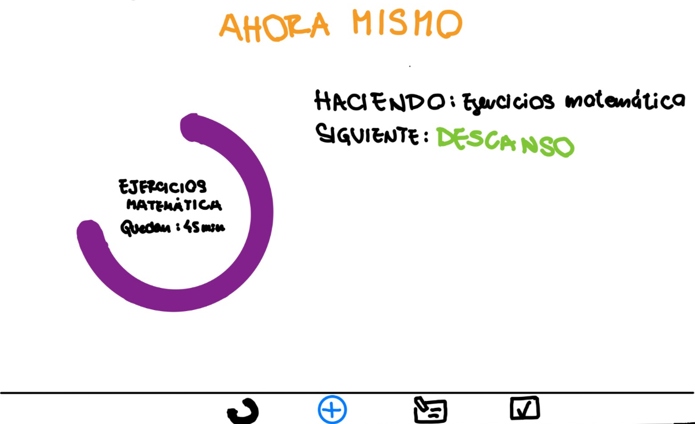

M4A - Docentes: Alejandro  Adorjan
- Agustin Alcarraz 281644
- Victoria Chappuis 278311
- Serena Vera 267108

# Fundamentos de Ingeniería en Software
## Objetivos: 
Hacer una planner que se adapte a las necesidades de cada uno, principalmente para personas con déficit atencional
## Descripción contexto: 
planner altamente customizable para TDAH, enfocado en poder organizar su día tener un dia eficiente, con un método de puntos (como para que no lo dejen colgado, se enganchen con ambición, racha, competencias) que se puedan marcar objetivos, que puedan agregar sus hábitos y metas diarias. puede adaptarse al mood de cada uno

## Repositorio
Creamos un repositorio en GitHub, en el cual vamos a subir todo nuestro trabajo a este repositorio remoto, utilizando los comandos dados en clase. En él está el Readme.md en el cual está todo el trabajo del obligatorio. A su vez, están presentes las carpetas "casosDeUso" en donde tiene las imágenes correspondientes a los perfiles que consideramos adecuados para nuestra aplicación.
## Versionado:
El obligatorio cuenta con dos ramas, una la **dev**, en la cual subimos todos nuestros avances con el objetivo de tener un cuerpo claro del obligatorio, para luego hacer un merge con la rama **main** cuando lleguemos a una versión completa.

# ELICITACIÓN

## Entrevista
Llevamos a cabo una entrevista con Laura Fazacas, técnica de estudio especializada en dificultades de aprendizaje. 
Su trabajo diario consiste en ayudar con tareas diarias a estudiantes de todas las edades con dificultades de aprendizaje, diagnosticadas o no, como pueden ser Dislexia, Disgrafía, Discalculia, Discapacidad de la memoria y el procesamiento auditivo, Trastorno por déficit de atención e hiperactividad (TDHA), Trastorno del espectro autista/Trastorno generalizado del desarrollo, entre otros.

En aspectos generales, comenzamos hablando de nuestros objetivos y a quienes estaba dirigido el proyecto, que es el TDHA, que tipos de TDHA existen, cómo podemos ayudarlos en su dia a dia, que problemas suelen tener las personas que trata y qué estrategias usa ella para ayudarlos.
Luego pasamos a hablar sobre como ella desarrollaría el planner ideal para un adolecente con TDHA, que factores son clave, que cosas debemos cuidar y que deberíamos evitar.

### Conclusiones de la entrevista
- El TDAH tiene varios tipos, y las personas con TDAH suelen padecer de otros trastornos mencionados anteriormente.
- Es imposible cubrir todas las necesidades o hacer un planner ideal para todos porque no todos tienen las mismas dificultades.
- Las técnicas organizacionales que se enseñan a las personas con TDAH le pueden servir a cualquiera.

Nos brindó consejos para tratar y generar recursos para personas con TDAH, estos son:
- Otorgar tiempo adicional tanto en su trabajo diario como en las evaluaciones. El tiempo que demanda procesar información es mayor.
- **Estimular y apoyar la organización** de todas sus tareas. Se ven beneficiados por la **anticipación**. Saber que viene siguiente, cuales son los eventos del día, etc.
- Presentar **instrucciones pautadas** para las tareas, el espacio gráfico suficiente para desarrollarla, escribir lo que sea necesario y a continuación la siguiente propuesta.
- Permitirle **descanso entre tareas** y cierto tiempo para que se "mueva" y retome la tarea.
- Es difícil para ellos anticipar cuánto tiempo les lleva prepararse y conmutar para atender ciertos eventos. Debemos recordarles antes de este tiempo, y darles instrucciones **claras y concisas** de cómo prepararse, como llegar, qué ómnibus, etc.
- Evitar cualquier elemento que pueda generar confusiones/desentendimientos: Simplificar enunciados, utilizar lenguaje claro y directo, reducir cantidad de preguntas, evitar letras con serifas, Escribir ciertos elementos clave en mayúsculas es de gran ayuda y utilizar colores fácilmente distinguibles.
- Tener siempre en cuenta que los _"elementos distractores"_ pueden ser perjudiciales para su desempeño.
- Deben poder visualizar su semana y a la vez tener sus tareas del día y sus horarios todos en un mismo lugar.
- La visualización es una estrategía clave, los gráficos los ayudan a **visualizar** la información y procesarla más eficientemente.
- Las tareas diarias y el visualizador semanal debe ser lo primero que vean, de lo contrario genera distorsiones.
- Las tareas completadas deben ser desechadas o tachadas para generar un estímulo positivo además de una mejor representación visual de las tareas próximas.
- Puede servirles iconizar ciertas tareas si lo desean.
- Es importante que sus acciones tengan un **feedback positivo** y no hacerlos sentir mal en caso de que no hayan llegado a cumplir con ciertos estándares. Algún tipo de premio siempre es bueno.
- La Técnica Pomodoro es un método para concentrarse probado muy eficiente para ellos.
- La app debe tener la posibilidad de imprimir el planner de la semana, a muchos de sus estudiantes les gusta tener su planner en la heladera, escritorio, cuarto, tenerlo en muchos lugares y muchas copias genera más instancias de recordatorios.
- Muchos toman pastillas para la concentración: recordatorio de tomar las pastillas y marcar las horas de concentración.
- Es difícil aprenderse información clave como número de cédula de identidad, número de teléfono de contactos importantes, dirección de casa , etc.

(No quiero poner porque es muy directo):
- Necesitan un lugar para poder tomar notas, hacer checklists, etc.

## INGENIERIA INVERSA
Investigamos y evaluamos dos apps para daily planning: Tiimo y Notion. Nos enfocamos en desglosar sus características clave, prestando especial atención en la interfaz de usuario y diseño. Buscamos patrones de diseño efectivos y mejores prácticas que podamos incorporar en nuestra propia aplicación.
¿Por qué elegimos estas dos y no otras? Notion es la más usada por estudiantes y Tiimo tiene como objetivo ser un planner más que nada visual hecho para personas con TDAH.

 ### Tiimo
Features principales:
- Al empezar te pregunta si SOS un pensador visual neurodivergente, esto permite que la app se orgnize de distintas maneras y da recomendaciones según las necesidades del perfil definido. También pregunta para qué quieres usar la app, ofrece opciones como: tareas del hogar, estudio, trabajo, etc.
- Elegir objetivos para que nos ayude, estos pueden ser: estrés, ansiedad, querer estructurar nuestras rutinas mejor, mejorar la concentración, entre otras.
- Nos permite crear un reminder para revisar los planes del día cada mañana y editarlos, también nos ofrece una revisión para la noche con el objetivo de revisar las tareas pendientes.
- Recordatorios diarios de ciertas tareas están disponibles
- Cuando se agrega una tarea, se le asigna un color y una representación visual. Además, se pueden establecer horarios y duraciones específicas para cada tarea, incluyendo un horario de inicio y finalización. Se brindan opciones flexibles, permitiendo establecer la duración de la tarea en cualquier momento del día o para toda la jornada. También se pueden programar repeticiones diarias, de lunes a viernes o mensuales, según sea necesario.
- En la página principal se presenta una visualización de nuestra semana con las actividades planificadas para cada día y un área con un _checklist_ de las actividades de hoy.
- Posee una sección de notas para agregar información adicional.
- En una de las pestañas se muestra la tarea que debería estar sucediendo en tiempo real, indicando la hora actual, de qué hora a qué hora es y cuánto tiempo restante para terminar la tarea, excelente para visualizar nuestro tiempo. Esto brinda una experiencia visual completa para el usuario y permite visualizar y esquematizar nuestro tiempo

### Notion
Notion es una aplicación de gestión que se adapta a una amplia variedad de necesidades. Su funcionamiento se basa en la creación de “carpetas” o “bases” que pueden contener una variedad de elementos como texto, listas de tareas, tablas, bases de datos, archivos adjuntos, y más. Estas bases tienen una estructura jerárquica, que permite organizar las páginas de manera estructurada, a modo de tener páginas principales y subpáginas dentro de ellas.
 
### Funcionamiento de Notion:
 
1. Creación de páginas: Los usuarios pueden crear páginas en blanco o elegir entre plantillas predefinidas para diferentes tipos de contenido, como notas, tareas, calendarios, entre otros.
 
2. Personalización: Cada página es altamente personalizable. Los usuarios pueden agregar texto, listas de tareas, imágenes, enlaces, y más, para adaptarla a sus necesidades específicas.
 
3. Organización: Las páginas se organizan en bases o carpetas, lo que facilita la estructuración de la información. Además, se pueden utilizar etiquetas y filtros para categorizar y buscar contenido rápidamente.
 
4. Colaboración: Notion permite la colaboración en tiempo real, lo que facilita el trabajo en equipo. Los usuarios pueden comentar en las páginas, asignar tareas y compartir documentos con otros usuarios.
 
### Dificultades para personas con déficit de atención:
 
1. Complejidad visual: Notion ofrece muchas opciones de formato y personalización, lo que puede resultar abrumador para personas con déficit de atención. Puede ser útil proporcionar una configuración simplificada o plantillas específicas para evitar distracciones visuales innecesarias.
 
2. Organización: Aunque la organización es una de las fortalezas de Notion, algunas personas con déficit de atención pueden encontrar desafíos para mantener una estructura coherente. Se recomienda proporcionar orientación y plantillas predefinidas para ayudar en este aspecto.
 
3. Fácil distracción: Notion es una herramienta flexible con muchas funciones, lo que podría llevar a distracciones si no se usa con un propósito específico. Se debe fomentar el enfoque en tareas concretas y proporcionar recordatorios visuales para mantenerse en el camino.
 
4. Gestión del tiempo: Las funciones de gestión del tiempo, como los calendarios y las fechas de vencimiento de tareas, son útiles, pero las personas con déficit de atención pueden necesitar recordatorios adicionales y alertas para seguir un horario.
 
En resumen, Notion es una poderosa herramienta de organización e información, pero para las personas con déficit de atención, puede requerir una adaptación cuidadosa para evitar distracciones y garantizar una experiencia más enfocada y productiva. Esto se puede lograr mediante la simplificación de la interfaz, la orientación clara y la implementación de recordatorios visuales. PUEDE IR EN CONCLUSIONES
 
## Conclusiones de la ingenieria inversa:
 dhhsh
 
## INVESTIGACIÓN

¿Qué es el Transtorno por Déficit de Atención e Hiperactividad o TDAH?
El TDAH es un trastorno psiquiátrico de origen biológico, a nivel cerebral, y con transmisión genética, que afecta a la capacidad del niño, adolescente o adulto de:
a) regular su nivel de actividad, por lo que tienen hiperactividad,
b) inhibir o frenar sus ideas,
pensamientos o comportamiento, por lo que tienen impulsividad, y
c) prestar atención a las acciones que realizan, por lo que sufren inatención.
En niño con TDAH tiene gran dificultad o incapacidad para prestar atención y concentrarse, presenta un nivel alto de actividad inadecuado para su edad, se distrae muy fácilmente y es muy impulsivo.

2. ¿Cómo se define el TDAH?
El TDAH se define como:
a) un nivel de inatención, o de hiperactividad e
impulsividad inadecuado para la edad del niño,
b) cuyos síntomas empiezan
antes de los 7 años de edad,
c) que produce un deterioro importante o afecta negativamente al niño o adolescente, en al menos dos ambientes de su vida (en casa, en el colegio, con los amigos...),
d) que dura al menos seis meses,
e) que no se debe a otro problema psiquiátrico (por ejemplo:
ansiedad, depresión),
f) ni a un problema médico, una sustancia (alcohol, drogas) o
alguna medicación.
Por lo tanto, la presencia de los síntomas no es suficiente; es necesario que los síntomas tengan un impacto en la vida del niño en dos ambientes, y que no sea por otra causa psiquiátrica, médic: o tóxica.

3. ¿Qué consecuencias tiene el
TDAH para el niño y su familia?
El TDAH tiene un efecto muy negativo sobre el que lo padece. A largo plazo, y si no se trata correctamente, produce una disminución del rendimiento académico que desemboca en fracaso escolar. Esto dificulta su paso a cursos superiores. Si pasancurso, no dominan la materia anterior y la base de conocimientos del niño se hace cada vez más endeble. Además, afecta al desarrollo social y emocional del niño. Debido a los múltiples problemas en las relaciones con los compañeros por su impulsividad, los niños con TDAH tienden a tener pocos amigos, poco duraderos, y las relaciones son menos estrechas. Debido a los fracasos repetidos en el colegio, las discusiones con los amigos y con los padres por malas notas y mal comportamiento, son frecuentes los síntomas depresivos e incluso la depresión en los niños con TDAH. Algunos niños con TDAH desarrollan comportamientos negativistas: desobediencias progresivas, desafío a la autoridad y, poco a poco, problemas de conducta mayores, e incluso, abuso de alcohol y drogas (especialmente, porros).No es un trastorno
"cosmético" o fruto del perfeccionismo de la sociedad. Los niños con
TDAH que no reciben tratamiento correcto
suelen alcanzar trabajos o profesiones por debajo de su capacidad.

- TDAH ripo hiperactivo-impulsivo (el niño sólo presenta hiperactividad e impulsividad), que es muy poco frecuente.
- TDAH tipo inatento (el niño tiene inatención).
- TDAH tipo combinado (el
mito presenta los tres sintomas
hiperactividad, impulsividad e inatención), que es el mas fecuente.

5. ¿Puede un niño con TDAH no ser hiperactivo?
Claro que sí. No todos los niños con TDAH
son hiperactivos. Los niños con TDAH tipo inatento no tienen hiperactividad o impulsividad; sólo presentan síntomas de inatención:
cometen errores por no prestar atención a los detalles, no mantienen la atención en tareas largas, parece que no escuchan, tienen dificultad para completar órdenes complejas (dejan las cosas a medias), evitan las acciones que requieren esfuerzo mental (dejan los deberes siempre para el final), son muy desorganizados, pierden cosas, son olvidadizos y se distraen con facilidad. Los niños con TDAH tipo inatento pueden pasar inadvertidos en clase porque no molestan. Como este tipo de TDAH es más frecuente en niñas, a veces pasan por "tontas" o "despistadas", se pasan el día "pensando en las musarañas". Suelen venir a la consulta en cursos más altos de primaria porque no "molestan" en clase.

10. ¿Qué características tiene y cómo se reconoce la inatención?
Los niños con inatención tienen muchas dificultades para realizar una misma actividad durante mucho tiempo. Se aburren enseguida tras unos minutos haciendo la tarea, se les va el santo al cielo y empiezan a pensar en otras cosas. Tienen que hacer un esfuerzo extra para terminar acciones rutinarias y mantenerse organizados. Si no se
cualquier estímulo que se cruza en su camino.  por ejemplo, al prepararse para ir al colegio 
, si mientras se viste ve un juguete que le atrae, se queda medio vestido jugado. Hay que decirle muchas veces que se vista, quitarle el juguete, acabar de vestirle y llevarle a desayunar, para encontrarle jugueteando con otra cosa y sin desayunar.
En el colegio, si tiene que ir a sacar punta al lápiz, puede encontrarse por el camino con otros niños con los que hará bromas y se distraerá; olvidará que iba a sacar punta, el profesor le llamará la atención y volverá a su sitio con el lápiz sin punta, teniendo que volver a levantarse... La inatención hace que cualquier estímulo o situación que se cruce por el camino del niño le haga
perder el norte y olvidarse de lo que estaba haciendo, dejando las cosas a medias. Los padres dicen: "está en todo y en nada", cambiando continuamente su foco de atención, sin alcanzar nunca el objetivo final.

¿Qué características tiene y como se reconoce la hiperactividad?
Los niños con hiperactividad están en movimiento constante, y tienen muchas dificultades para permanecer sentados durante mucho tiempo (en clase, en la cena, en la iglesia, viendo la TV, etc.).
Se levantan y merodean sinsentido, y hablan sin parar. Les resulta imposible aguantar una clase entera sentados y quietos.
Se levantan y dan vueltas por la clase. Cuando están sentados, se mueven mucho en la silla, enredando con los pies y manos, cambiando de postura, tocándolo todo, por lo que, con frecuencia, las cosas se les caen al suelo. Son ruidosos, y están siempre dando golpecitos en la mesa o canturreando.
Otras veces, aunque no se mueven, dicen que se sienten inquietos o nerviosos. Los padres cuentan que estos niños mordisquean y rompen los lápices y bolígrafos, desarman las cosas con piezas, perdiendo o estropeando algunas y no pueden armarlas de nuevo (desarman un bolígrafo y pierden el muelle o lo estiran); a veces, también muerden la ropa o arrancan los hilitos que sobresalen hasta que los rompen.

¿Qué características tiene y como se reconoce la impulsividad?
Los niños con impulsividad tienen dificultades para inhibir o modular sus respuestas o reacciones inmediatas ante las situaciones. Es decir, les resulta difícil no hacer lo primero que les apetece o se les ocurre. No piensan en las consecuencias de sus actos y directamente hacen (o dicen) lo primero que piensan, lo que se les pasa por la cabeza. Por eso, en clase responden sin pensar, a veces, incluso antes de que el profesor haya terminado de formular la pregunta, sin pensar realmenteen lo que se les está preguntando. Hacen comentarios inapropiados sin pensar en la reacción de la otra persona. Por ejemplo, dicen en voz alta "vaya tontería" tras una explicación del profesor, lo que les acarrea un castigo o un punto negativo. Un niño sin impulsividad pensaría que lo que dice el profesor es una tontería, pero que si él lo dice en alto le pueden castigar y decidiría no decir nada. Los niños con TDAH no tienen ese diálogo interior antes de realizar una acción, no valoran las posibilidades ni las consecuencias de cada posible respuesta, simplemente actúan y luego sufren las consecuencias. Sól.
ven las consecuencias de sus actos cuando es demasiado tarde y ya han hecho o dicho algo inapropiado. Sin embargo, a pesar de sufrir consecuencias, no aprenden, y más adelante se vuelven a dejar llevar por la primera cosa que se les ocurre, reaccionando impulsivamente.
Su impulsividad hace que les resulte muy difícil esperar su turno para hacer algo, por ejemplo en juegos y, por ello, no son aceptados por los compañeros (por ejemplo: en un partido saca una falta antes de dar tiempo a que se coloque la barrera, habiendo dicho el entrenador que fuera otro el que debía sacarla).

17. ¿Cómo son los adolescentes con TDAH?
Los adolescentes con TDAH pueden no tener una hiperactividad tan evidente como los niños, perotodavía enredan en exceso con las manos, hacen ruiditos, dan golpecitos y sienten inquietud interna. Los padres dicen que la hiperactividad mejora bastante.
Sin embargo, todavía son desorganizados en sus trabajos escolares y les cuesta mucho acabar las cosas. Les resulta difícil trabajar de forma independiente, todavía hay que estar encima de ellos para que acaben sus tareas y estudios. Suelen tener
más comportamientos arriesgados (fumar, beber, consumir drogas, tener accidentes, actuar impulsivamente, etc). Sufren autoestima baja por sus fracasos, y por sus peores relaciones con sus iguales presentan dificultades y encontronazos con las figuras de autoridad (padres, profesores, entrenadores). A veces, si el niño es inteligente y sus padres han estado muy pendientes de las tareas escolares, puede no notarse
el TDAH hasta la adolescencia, donde los trabajos son más complejos y se requiere no sólo un trabajo mecánico, sino
asociación de conceptos
aprendidos anteriormente.

18. ¿Qué complicaciones tienen los adolescentes con TDAH?

adecuado tienen más riesgo de empezar a fumar tabaco, beber alcohol, consumir drogas como marihuana y tener relaciones sexuales más tempranas (y por ello tienen hijos mucho antes y más enfermedades de transmisión sexual) que los adolescentes sin TDAH.También repiten curso más frecuentemente y terminan el bachillerato y pasan a la Universidad en menor proporción que los adolescentes sin TDAH. Esto se debe a que no
piensan las consecuencias de sus actos y no aprenden de sus errores.

ETIOLOGÍA- Causas del TDAH

30. ¿Qué neurotransmisores están
implicados en el TDAH?
Los estudios indican que en el TDAH hay problemas en los circuitos reguladores 
que comunican el córtex prefrontal y los ganglios basales. Estas dos áreas del cerebro se comunican mediante la dopamina y la noradrenalina. Estas zonas y circuitos están, además, regulados por inervación dopaminérgica procedente del la zona de los pedúnculos cerebrales en el tronco del encéfalo. Los estudios con animales indican que niveles bajos de noradrenalina en el cerebro
producen hiperactividad e impulsividad. El córtex prefontral controla la persistencia en una tarea (atención mantenida), la resistencia a la distracción (inhibición motora), y la capacidad de volver a una tarea después de distraernos (memoria de trabajo).

## OBSERVACION

## Modelado de usuarios del Sistema
Esta aplicacion esta dise;ada enfocada a personas con tdah sin embargo muchas personas elijen usar este tipo de metodos, por lo tanto tambien vamos a agregarlos a nuestro publico

[template de user personas2]

## ESPECIFICACIÓN
## Requirimientos Funcionales
###  Rf1: Ingreso y actualización de tareas 
Actor: usuario
Descripción: el usuario debe poder tanto ingresar y actualizar el estado de las tareas(en proceso, 	finalizado) tareas en su planner
Prioridad: alta

### Rf2: Sistema de puntos:
Actor : usuario
Descripción: el sistema deberá brindar, los puntos correspondientes de acuerdo a la racha de tareas completadas
Prioridad: alta
	
### Rf3: Mascota
Actor: Sistema 
Descripción: la mascota deberá cambiar su estado de ánimo de acuerdo al puntaje promedio del dia 
Prioridad: media

### Rf4: Estadísticas
Actor: Sistema
Descripcion: el sistema debera mostrar en pantalla el porcentaje de tareas completadas en el día
Prioridad: alta
 
### Rf5: Visualización de todas las tareas:
Actor: Sistema
Descripcion: el sistema tiene que mostrar todas las tareas del dia
Prioridad: alta

### Rf6: Notas
Actor: usuario
Descripcion: el usuario podra tener la opcion de poder escribir notas rapidas
Prioridad baja

### Rf7: Agregacion de alarmas
Actor: usuario
Descripción: el usuario deberá poder agregar recordatorios, de modo que se le active una alarma.
Prioridad alta

## Requerimientos no Funcionales

### Rnf1: Sistema de compatibilidad
Descripción: el planner deberá soportar celulares con sistema operativo: Android 10 o IOS 13 o sus versiones superiores

### Rnf2: Idiomas soportados
Descripción: la aplicación deberá ser desarrollada principalmente en español e inglés

### Rnf3 Validación de la aplicación
Descripción: para poder subir la aplicación tanto para la Play Store de android como en la App Store de IOS, deberá cumplir con los standards de dichas tiendas 

### Rnf4: Interfaz y logica
Descripción: la interfaz del planner sera en XXX y la logica en XXX

## HISTORIAS DE USUARIO

## Historias de usuario 1
**Título:** Planificación

- **Como** usuario
- **Quiero** poder planificar mi vida diaria y semanal
- **Para** estimularme y poder tener una organización sobre mi vida

**Criterios de aceptación:**
- El usuario tendrá que agregar sus respectivas tareas para que pueda usar el planner.
## Historias de usuario 2
**Título:** Sistema de puntuación

- **Como** usuario
- **Quiero** que cada vez que complete una tarea se me recompense
- **Para** sentirme motivado y seguir usando la aplicación.

**Criterios de aceptación:**
- El usuario deberá terminar la tarea.

## Historias de usuario 3
**Título:** Estadísticas

- **Como** usuario
- **Quiero**poder poner recordatorios y que me avisen
- **Para** poder concentrarme con el objetivo de hacer otras tareas.

**Criterios de aceptación:**
- El usuario tendrá que poner en la sección de recordatorios la tarea y a que hora deberá ser activada la alarma.

## CASOS DE USO
## Caso de uso 1
título
actor
curso normal
curso alternativo
## Caso de uso 2

## VALIDACION Y VERIFICACION
## REFLEXIÓN

 

## preguntas para la entrevista:
que es el adhd
que dificultades presenta en el dia a dia una persona con adhd
como trabajas tu con gente con adhd
como responden al estimulo la gente con adhd? estimulo positivo? negativo? ambos?
cuales son buenas practicas para tratar con gente con adhd?
que recursos usas para tratar con esta gente?
g
