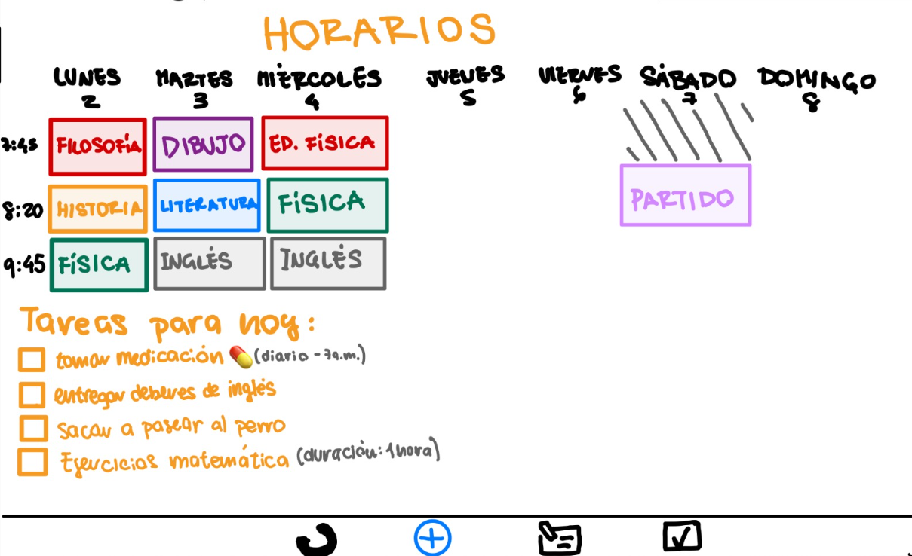

M4A - Docentes: Alejandro  Adorjan
- Agustin Alcarraz 281644
- Victoria Chappuis 278311
- Serena Vera 267108

# Fundamentos de Ingeniería en Software
## Repositorio
Creamos un repositorio en GitHub, en el cual vamos a subir todo nuestro trabajo a este repositorio remoto, utilizando los comandos dados en clase. En él esta el Readme.md en el cual esta todo el trabajo del obligatorio. A su vez, estan presentes las carpetas "casosDeUso" en donde tiene las imagenes correspondientes a los perfiles que considermas adecuados para nuestra aplicación.
## Versionado:
El obligatorio cuenta con dos ramas, una la **dev**, en la cualsubimos todos nuestos avances con el objetivo de tener un cuerpo claro del obligatiorio, para luego hacer un merge con la rama **main** cuando lleguemos a una version completa.

## ELICITACIÓN

## Entrevista
Llevamos a cabo una entrevista con Laura Fazacas, técnica de estudio especializada en dificultades de aprendizaje. 
Su trabajo diario consiste en ayudar con tareas diarias a estudiantes de todas las edades con dificultades de aprendizaje, diagnosticadas o no, como pueden ser Dislexia, Disgrafía, Discalculia, Discapacidad de la memoria y el procesamiento auditivo, Trastorno por déficit de atención e hiperactividad (TDHA), Trastorno del espectro autista/Trastorno generalizado del desarrollo, entre otros.

En aspectos generales, comenzamos hablando de nuestros objetivos y a quienes estaba dirigido el proyecto, que es el TDHA, que tipos de TDHA existen, como podemos ayudarlos en su dia a dia, que problemas suelen tener las personas que trata y que estrategias usa ella para ayudarlos.
Luego pasamos a hablar sobre como ella desarrollaria el planner ideal para un adolecente con TDHA, que factores son clave, que cosas debemos cuidar y que deberiamos evitar.

## Conclusiones de la entrevista
- El TDAH tiene varios tipos, y las personas con TDAH suelen padecer de otros trastornos mencionados anteriormente.
- Es imposible cubrir todas las necesidades o hacer un planner ideal para todos porque no todos tienen las mismas dificultades.
- Las tecnicas organizacionales que se son ensenadas a las peronas con TDAH le pueden servir a cualquiera.

- La visualizacion es un concepto clave para dessarrollar herramientas organizacionales para personas con TDAH.
- deben poder visualizar su semana y a la vez tener sus tareas del dia y sus horarios todos en un mismo lugar
- Las tareas diarias y el visualizador semanal debe ser lo primero que vean al entrar a la app, se distraen de lo contrario.
- Las tareas completadas deben ser deshechadas o tachadas para generar un estimulo
- Puede servirles iconizar ciertas tareas si lo desean. 
- La app debe tener la posibilidad de imprimir el planner de la semana, a muchos de sus estudiantes les gusta tener su planner en la heladera, escritorio, cuarto, tenerlo en muchos lugares y muchas copias puede ser de gran ayuda.
- La visualizacion en horizontal es percepcionalmente mejor.
- Evitar cualquier elemento que pueda generar confusiones/desentendimientos: Los colores deben ser facilmente distnguibles, el leguaje implementado debe ser simple y concreto, evitar letras con serifas.
- Escribir ciertos elementos clave en mayusculas es de gran ayuda.

- Es bueno que anticipen que es lo que viene siguiente y estar preparados para lo necesario
- Puede ser positivo que a la ma;ana o noche del dia anterior tengan un review de su dia.
- Es dificil para ellos anticipar cuanto tiempo les lleva prepararse y comutar para atender ciertos eventos
- debe tener un reminder antes de este tiempo, y decir como llegar, omnibus etc

- Necesitan un lugar para poder tomar notas, hacer checklists, etc.
- Es importante que sus acciones tengan un feedback positivo.
- Debe tener algun tipo de "premio"
- MUchos toman pastillas para la concentracion: recordaatorio de tomar las pastillas y marcar las horas de concentracion.
- Es dificil aprenderse info clave como ci numero de telefono de contactos importantes, direccion de casa , etc.
- El pomodoro tracker es un metodo para conentrarse probado muy eficiente para ellos.

## INGENIERIA INVERSA
Investigamos y evaluamos dos apps para daily planning: Tiimo y Notion. Nos enfocamos en desglosar sus características clave, prestando especial atención en la interfaz de usuario y diseño. Buscamos patrones de diseño efectivos y mejores prácticas que podamos incorporar en nuestra propia aplicación.

Porque elegimos estas dos y no otras? Lists to do se enfoca en la organizacion y mantenimiento de los habitos mientras que Tiimo tiene como objetivo ser un planner mas que nada visual hecho para personas con TDAH.

 ## Tiimo

Al empezar te pregunta si SOS un pensador visual neurodivergente,esto permite un área de fotos y recomendaciones según las necesidades del perfil definido.

Te pregunta para que quieres usar la app : tareas del hogar estudio trabajo etc
Elegir objetivos para que nos ayude: estrés ansiedad estructurar enfocar rutinas 
…parte de login
Revisar los planes del día cada mañana
Revisar a la noche para revisar tareas pendientes
Recordatorios diarios
Al añadir tarea:
Le da un color , visualización
Establece un horario y DURACIÓN
Horario de inicio y finalización 
Opciones en cualquier momento o todo el dia 
Se programa repetición: cada dia / l a v mensual etc
En la página principal vemos nuestra semana y un área con un checklist de las actividades de hoy.
Hay una sección de notas
En una página muestra lo que está pasando ahora mismo, de qué hora a qué hora es,  cuánto tiempo falta para terminar la tarea etc

Tiimo es una aplicación diseñada pensando en personas neurodivergentes con un enfoque en la representación visual. Al iniciar, se pregunta si eres un pensador visual neurodivergente, lo que permite crear un perfil personalizado con fotos y recomendaciones según las necesidades identificadas.

Al iniciar sesión, la aplicación te pregunta para qué deseas utilizarla, ya sea para tareas del hogar, estudio, trabajo, etc. Además, te permite seleccionar objetivos para recibir ayuda en aspectos como estrés, ansiedad, estructuración y enfoque de rutinas.

Después del inicio de sesión, se establecen rutinas como revisar los planes del día cada mañana y hacer una revisión nocturna de las tareas pendientes. La aplicación proporciona recordatorios diarios para apoyar en la gestión del tiempo.

Cuando se agrega una tarea, se le asigna un color y una representación visual. Además, se pueden establecer horarios y duraciones específicas para cada tarea, incluyendo un horario de inicio y finalización. Se brindan opciones flexibles, permitiendo establecer la duración de la tarea en cualquier momento del día o para toda la jornada. También se pueden programar repeticiones diarias, de lunes a viernes o mensuales, según sea necesario.

En la página principal de la aplicación, se presenta una visualización semanal que muestra las actividades planificadas para cada día, acompañadas de un área con una lista de verificación de las actividades para el día actual. Además, hay una sección de notas para agregar información adicional.

Adicionalmente, Tiimo muestra en una página especial lo que está sucediendo en tiempo real, indicando la hora actual, la duración de la tarea en curso y el tiempo restante para completarla, brindando una experiencia visual y temporal completa para el usuario.

## Notion
Notion es una aplicación de gestión que se adapta a una amplia variedad de necesidades. Su funcionamiento se basa en la creación de “carpetas” o “bases” que pueden contener una variedad de elementos como texto, listas de tareas, tablas, bases de datos, archivos adjuntos, y más. Estas bases tienen una estructura jerárquica, que permite organizar las páginas de manera estructurada, a modo de tener páginas principales y subpáginas dentro de ellas.
 
### Funcionamiento de Notion:
 
1. Creación de páginas: Los usuarios pueden crear páginas en blanco o elegir entre plantillas predefinidas para diferentes tipos de contenido, como notas, tareas, calendarios, entre otros.
 
2. Personalización: Cada página es altamente personalizable. Los usuarios pueden agregar texto, listas de tareas, imágenes, enlaces, y más, para adaptarla a sus necesidades específicas.
 
3. Organización: Las páginas se organizan en bases o carpetas, lo que facilita la estructuración de la información. Además, se pueden utilizar etiquetas y filtros para categorizar y buscar contenido rápidamente.
 
4. Colaboración: Notion permite la colaboración en tiempo real, lo que facilita el trabajo en equipo. Los usuarios pueden comentar en las páginas, asignar tareas y compartir documentos con otros usuarios.
 
### Dificultades para personas con déficit de atención:
 
1. Complejidad visual: Notion ofrece muchas opciones de formato y personalización, lo que puede resultar abrumador para personas con déficit de atención. Puede ser útil proporcionar una configuración simplificada o plantillas específicas para evitar distracciones visuales innecesarias.
 
2. Organización: Aunque la organización es una de las fortalezas de Notion, algunas personas con déficit de atención pueden encontrar desafíos para mantener una estructura coherente. Se recomienda proporcionar orientación y plantillas predefinidas para ayudar en este aspecto.
 
3. Fácil distracción: Notion es una herramienta flexible con muchas funciones, lo que podría llevar a distracciones si no se usa con un propósito específico. Se debe fomentar el enfoque en tareas concretas y proporcionar recordatorios visuales para mantenerse en el camino.
 
4. Gestión del tiempo: Las funciones de gestión del tiempo, como los calendarios y las fechas de vencimiento de tareas, son útiles, pero las personas con déficit de atención pueden necesitar recordatorios adicionales y alertas para seguir un horario.
 
En resumen, Notion es una poderosa herramienta de organización e información, pero para las personas con déficit de atención, puede requerir una adaptación cuidadosa para evitar distracciones y garantizar una experiencia más enfocada y productiva. Esto se puede lograr mediante la simplificación de la interfaz, la orientación clara y la implementación de recordatorios visuales. PUEDE IR EN CONCLUSIONES
 
## Conclusiones de la ingenieria inversa:

## OBSERVACION

## Modelado de usuarios del Sistema
Esta aplicacion esta dise;ada enfocada a personas con tdah sin embargo muchas personas elijen usar este tipo de metodos, por lo tanto tambien vamos a agregarlos a nuestro publico

[template de user personas2]

## ESPECIFICACIÓN
## Requirimientos Funcionales
###  Rf1: Ingreso y actualización de tareas 
Actor: usuario
Descripción: el usuario debe poder tanto ingresar y actualizar el estado de las tareas(en proceso, 	finalizado) tareas en su planner
Prioridad: alta

### Rf2: Sistema de puntos:
Actor : usuario
Descripción: el sistema deberá brindar, los puntos correspondientes de acuerdo a la racha de tareas completadas
Prioridad: alta
	
### Rf3: Mascota
Actor: Sistema 
Descripción: la mascota deberá cambiar su estado de ánimo de acuerdo al puntaje promedio del dia 
Prioridad: media

### Rf4: Estadísticas
Actor: Sistema
Descripcion: el sistema debera mostrar en pantalla el porcentaje de tareas completadas en el día
Prioridad: alta
 
### Rf5: Visualización de todas las tareas:
Actor: Sistema
Descripcion: el sistema tiene que mostrar todas las tareas del dia
Prioridad: alta

### Rf6: Notas
Actor: usuario
Descripcion: el usuario podra tener la opcion de poder escribir notas rapidas
Prioridad baja

### Rf7: Agregacion de alarmas
Actor: usuario
Descripción: el usuario deberá poder agregar recordatorios, de modo que se le active una alarma.
Prioridad alta

## Requerimientos no Funcionales

### Rnf1: Sistema de compatibilidad
Descripción: el planner deberá soportar celulares con sistema operativo: Android 10 o IOS 13 o sus versiones superiores

### Rnf2: Idiomas soportados
Descripción: la aplicación deberá ser desarrollada principalmente en español e inglés

### Rnf3 Validación de la aplicación
Descripción: para poder subir la aplicación tanto para la Play Store de android como en la App Store de IOS, deberá cumplir con los standards de dichas tiendas 

### Rnf4: Interfaz y logica
Descripción: la interfaz del planner sera en XXX y la logica en XXX

## HISTORIAS DE USUARIO
## Historias de usuario 1
## Historias de usuario 2

## CASOS DE USO
## Caso de uso 1
título
actor
curso normal
curso alternativo
## Caso de uso 2

## VALIDACION Y VERIFICACION
## REFLEXIÓN

## Objetivos: 
Hacer una planner que se adapte a las necesidades de cada uno, principalmente para personas con déficit atencional
## Descripción contexto: 
planner altamente customizable para TDAH, enfocado en poder organizar su día tener un dia eficiente, con un método de puntos (como para que no lo dejen colgado, se enganchen con ambición, racha, competencias) que se puedan marcar objetivos, que puedan agregar sus hábitos y metas diarias. puede adaptarse al mood de cada uno

 

## preguntas para la entrevista:
que es el adhd
que dificultades presenta en el dia a dia una persona con adhd
como trabajas tu con gente con adhd
como responden al estimulo la gente con adhd? estimulo positivo? negativo? ambos?
cuales son buenas practicas para tratar con gente con adhd?
que recursos usas para tratar con esta gente?
g
